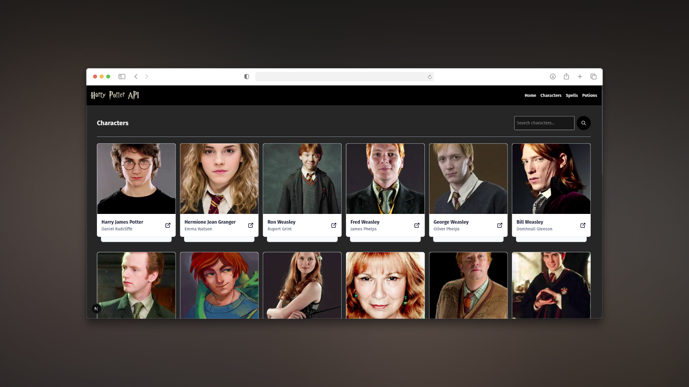

# Proyecto Practico: Harry Potter API con Next.js

Este es un proyecto de ejemplo que utiliza la API de Harry Potter para mostrar información sobre los personajes de la saga. La aplicación está construida con Next.js y utiliza características modernas de React.

## Preview

